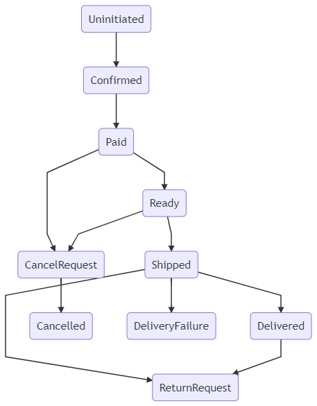

Order States management

An Order in MoT should represent at least the following states:

* UnInitiated : An order will be created in this state. This will be the default value of the database field. It means that no reasonable action has been taken to that order.
* Confirmed : User has decided to purchase current cart items. At this point, Order object is attached to a cart that is in Confirmed state.
              A Confirmed Order has attached variants through Confirmed Cart.
* Paid      : User has successfully paid for this order.
* Ready     : The order has been accepted by the vendor and is ready to ship.
* Shipped   : The Items in order have been packaged  and are being delivered by the vendor.
* Delivered : The Order has been delivered by the shipping service.
* CancelRequest : Customer has requested to cancel the order. An order can only enter into this request if it in one of the following states [Paid, Unpaid]
* Cancelled : The Cancellation request has been approved by vendor. The customer will be refunded. A refund process needs to be outlined.   
* Return Request : The customer wishes part of an order or an entire needs to be returned. A return request will create a return request object in the system.   
* DeliveryFailure: The delivery service failed to deliver the order. There will be reasons attached as delivery failure notes.                

An order is considered in 'Pending' state for front end display when it is Paid or Unpaid.

Properties of Refund Object

* Refund Amount
* RefundOrder Type (Cancellation or Return Request)
* Refund Method (MoT Credit, Original Payment Method)

Properties of Cancel Request Object

* Cancel Reason
* Cancel Text Reason
* Cancel Status
* Link to Store Order

Properties of Return Request Object

* Return Reason
* product variants that is being returned, along with quantities.
* Return Status (When the vendor receive  the items as expected , set the status to complete.)

Update on May 27 2022
---------------------
1. Junaid agrees that orders can be cancelled right away from `Paid` state. There is no cancellation approval required in that case.
2. When an order is in `Ready` state, cancellation approval is required from seller.
3. Junaid guarentees that process of marking order, shipping company will mark order delivered, when it is delivered. Hence, there should be no path to return request, from `Shipped`.

NOTE: Image is not updated. remove this note after updating the image.